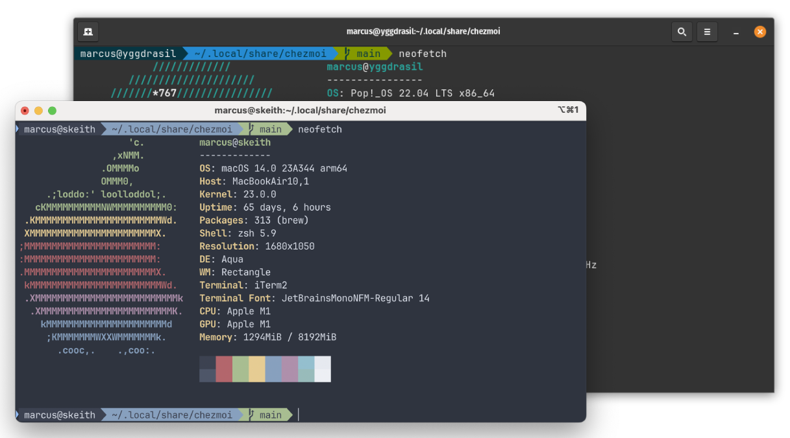

# dotfiles

> View my dotfiles in literate form at [dotfiles.utf9k.net](https://dotfiles.utf9k.net)

<center>



</center>

This repository contains my dotfiles which are shared between my home and work machines which consist of both macOS and Linux devices.

I have more macOS devices than Linux but I aspire to keep the installation as seamless as possible between the two.

In saying that, this repository definitely has some sharp edges so while you're welcome to take whatever from it, do note that there are no guarantees of anything working or being easy to use.

[Chezmoi](https://github.com/twpayne/chezmoi) is my dotfile manager which both manages files as well as runs some pre and post-installation scripts to install dependencies, programming languages and libraries that I use day to day.

I have a wonky (read: gross) language manager abstraction visible in [`.chezmoidata.yaml`](.chezmoidata.yaml) which selectively installs different language runtimes depending on whether the machine is used for home or work.

Currently I use [rtx](https://github.com/jdx/rtx) to manage languages and previously used [asdf](https://asdf-vm.com/) for quite a few years.

My shell of choice is zsh, with [oh-my-zsh](https://ohmyz.sh/) although from time to time I flip between OMZ and raw zsh as I don't really use many features from it.

## Installation

On a fresh machine, it's supposed to be possible to both install `chezmoi` and my dotfiles in one go like so:

```bash
sh -c "$(curl -fsLS get.chezmoi.io)" -- init --apply marcus-crane
```

I say supposed to because I don't set up machines from scratch very often, and each time I do, there's usually some bootstrapping problem like hard references to chezmoi that don't resolve, because it isn't installed yet where my shell scripts expect it to be.

As mentioned, there's no guarantee that this repo will be easy to set up, as it's not intended for others to be running day to day.

## A note on tangling files

You may notice that some configuration files are seemingly missing with `.md` files in their place.

This is because a few, and in time most of, my config files are kept as "literate configuration".

In short, all of the surrounding commentary is stripped and the correct file is generated off of the source code blocks.

In order to "tangle" them into a proper config, I use [lugh](https://github.com/marcus-crane/lugh), a hacky custom made tool for tangling markdown that I made one day to play with [crystal](https://crystal-lang.org). It's just sort of stuck around so I haven't had any reason to deprecate it but there are probably better tool for this sort of thing.

I have used Emacs `org-tangle` for this job and it's nice but it's also quite a bit of overhead to get it running. Generally on a new machine, compiling Emacs can take quite some time.

Anyway, `lugh` should be installed automatically as part of the initial `chezmoi apply` so with that, you can "tangle" the file you're interested in like so:

```bash
lugh -f <file>
```

A working example would be:

```bash
lugh -f zshrc.md
# Wrote /Users/marcus/.local/share/chezmoi/dot_zshrc.tmpl
```

Instead of anything fancy, I just "tangle" the contents into a file that chezmoi expects and since it's a `.tmpl` file, it can also make use of chezmoi's built in variables.

## Extras to be manually installed

- Wallpaper - [evangelion-clock-screensaver](https://github.com/Wandmalfarbe/evangelion-clock-screensaver)
- Font - [JetBrainsMono Nerd Font](https://www.nerdfonts.com/font-downloads) Regular 14
